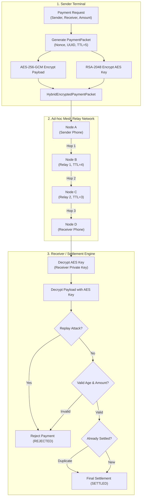

# 🌐 Offline UPI — Secure Mesh-Based Digital Payment System

[](https://openjdk.org/)
[](https://spring.io/projects/spring-boot)
[](https://github.com/supritpal/Offline-UPI)
[](https://github.com/supritpal/Offline-UPI)
[](https://github.com/supritpal/Offline-UPI)
[](https://www.h2database.com/)
[](LICENSE)

An enterprise-grade, resilient **Offline Payment Simulation Framework** designed to facilitate digital transactions in zero-connectivity environments, rural regions, and disaster recovery zones.

The system combines **Hybrid Cryptography (AES-256-GCM + RSA-2048 OAEP)**, **Multi-Hop Peer-to-Peer (P2P) Mesh Routing**, **Anti-Replay Protection**, and a **Strict Finite-State Settlement Pipeline** to guarantee transaction integrity, authenticity, and non-repudiation without requiring real-time internet access.

---

## 📑 Table of Contents

- [Problem Statement](#-problem-statement)
- [Key Features](#-key-features)
- [Architecture & Workflow](#-architecture--workflow)
- [Cryptographic Security Model](#-cryptographic-security-model)
- [Tech Stack](#-tech-stack)
- [Project Structure](#-project-structure)
- [API Reference & Examples](#-api-reference--examples)
- [Getting Started](#-getting-started)
- [Running Tests](#-running-tests)
- [Roadmap & Enhancements](#-roadmap--enhancements)
- [Author & License](#-author--license)

---

## 💡 Problem Statement

Traditional digital payment infrastructures (like standard online UPI) require uninterrupted internet connectivity at both sender and receiver terminals. In areas with network blackouts, natural disasters, or weak cellular coverage, digital commerce stalls completely.

**Offline UPI** solves this by:
1. Enabling secure **device-to-device payment packet generation** offline.
2. Routing packets through **intermediate relay nodes** in an ad-hoc mesh network.
3. Guaranteeing that intermediate relay devices cannot read or alter transaction details (**End-to-End Encryption**).
4. Defending against **replay attacks, double-spending, and forged packets** upon reaching destination/connectivity.

---

## ✨ Key Features

- 🔐 **Dual-Layer Hybrid Cryptography**:
  - Fast payload encryption using symmetric **AES-256-GCM** with dynamic, cryptographically secure 12-byte IVs and 128-bit authentication tags.
  - Ephemeral AES session keys protected with asymmetric **RSA-2048 OAEP** (`SHA-256 + MGF1`).
- 📡 **Multi-Hop Mesh Network Routing**:
  - Simulates ad-hoc device routing (`Sender` $\rightarrow$ `Relay 1` $\rightarrow$ `Relay 2` $\rightarrow$ `Receiver`).
  - Strict **Time-To-Live (TTL)** decrements per hop to mitigate routing loops and packet flooding.
- 🛡️ **Replay Attack & Tamper Defense**:
  - In-memory thread-safe `ConcurrentHashMap` tracking of unique `packetId` and cryptographically random nonces.
  - GCM authentication tags prevent payload manipulation across untrusted relay nodes.
- ⏱️ **Time-Windowed Payment Validation**:
  - Enforces strict payment expiry windows (max age: 5 minutes) and rejects future-dated timestamps.
- 🔁 **Idempotent Processing**:
  - Deduplicates repeated submissions to protect against multiple state transitions for the same `transactionId`.
- 📊 **Multi-Stage Settlement Pipeline**:
  - Finite State Machine (FSM): `CREATED` $\rightarrow$ `QUEUED` $\rightarrow$ `RECEIVED` $\rightarrow$ `VALIDATED` $\rightarrow$ `SETTLED` (or `REJECTED`).
- 🗄️ **Store-and-Forward Offline Queue**:
  - Built-in persistence for queued transactions waiting for network sync or peer discovery.

---

## 🏗 Architecture & Workflow



---

## 🔒 Cryptographic Security Model

| Security Layer | Algorithm / Standard | Purpose |
| :--- | :--- | :--- |
| **Payload Encryption** | `AES-256-GCM` (`AES/GCM/NoPadding`) | High-speed symmetric encryption ensuring payload confidentiality & integrity. |
| **Key Exchange** | `RSA-2048` (`OAEPWithSHA-256AndMGF1Padding`) | Securely transports the ephemeral AES key to the recipient's public key. |
| **Initialization Vector (IV)** | 12-byte `SecureRandom` IV prepended to ciphertext | Prevents ciphertext pattern analysis; unique for every encryption cycle. |
| **Integrity Check** | 128-bit GCM Authentication Tag | Rejects tampered or modified packets during AES decryption. |
| **Replay Protection** | UUID Nonce + In-Memory Packet Ledger | Rejects re-transmitted duplicate payment packets. |
| **Validity Expiration** | 5-Minute Time-Window Check | Prevents stale or delayed transaction replay. |

---

## 🛠 Tech Stack

- **Language:** Java 25
- **Framework:** Spring Boot 4.1.1 (Spring MVC, Spring Data JPA, Spring Validation)
- **Database:** In-Memory H2 Database (with H2 Web Console enabled)
- **Object Mapping / JSON:** Jackson with JSR-310 Date/Time Module
- **Testing:** JUnit 5, Mockito, Spring Boot Starter Test
- **Build Tool:** Apache Maven (Wrapper included)

---

## 📂 Project Structure

```
offline-upi/
├── src/
│   ├── main/
│   │   ├── java/com/offlineupi/
│   │   │   ├── OfflineUpiApplication.java       # Spring Boot main entrypoint
│   │   │   ├── controller/
│   │   │   │   ├── PaymentController.java       # REST API endpoints
│   │   │   │   └── HelloController.java         # Service health check
│   │   │   ├── dto/
│   │   │   │   └── PaymentRequest.java          # Validation request payload
│   │   │   ├── entity/
│   │   │   │   ├── Payment.java                 # Core payment entity
│   │   │   │   ├── OfflinePayment.java          # Offline queue record
│   │   │   │   └── PaymentStatus.java           # Payment state enum
│   │   │   ├── exception/
│   │   │   │   └── GlobalExceptionHandler.java  # Unified REST error handler
│   │   │   ├── mesh/
│   │   │   │   ├── MeshNode.java                # Network node representation
│   │   │   │   ├── MeshNetwork.java             # Topology holder
│   │   │   │   └── MeshRouter.java              # Hop routing & TTL manager
│   │   │   ├── packet/
│   │   │   │   ├── PaymentPacket.java           # Plaintext packet model
│   │   │   │   ├── EncryptedPaymentPacket.java  # AES-encrypted packet
│   │   │   │   └── HybridEncryptedPaymentPacket.java # AES + RSA hybrid packet
│   │   │   ├── repository/
│   │   │   │   ├── PaymentRepository.java       # JPA repo for Payment
│   │   │   │   └── OfflinePaymentRepository.java# JPA repo for OfflinePayment
│   │   │   ├── security/
│   │   │   │   ├── EncryptionService.java       # AES-256-GCM cipher service
│   │   │   │   ├── RsaKeyPairService.java       # RSA key pair generator
│   │   │   │   ├── RsaEncryptionService.java    # RSA OAEP cipher service
│   │   │   │   ├── HybridEncryptionService.java # End-to-end hybrid crypto
│   │   │   │   ├── ReplayProtectionService.java # Nonce/Packet replay defender
│   │   │   │   ├── IdempotencyService.java      # Transaction deduplication
│   │   │   │   └── PaymentValidationService.java# Expiry & parameter validator
│   │   │   └── service/
│   │   │       ├── PaymentService.java          # Payment creation & packet mapping
│   │   │       ├── OfflineQueueService.java     # Local queue manager
│   │   │       ├── SettlementService.java       # Progressive state settlement
│   │   │       ├── MeshSimulationService.java   # Basic mesh routing simulator
│   │   │       └── SecureMeshSimulationService.java # Full secure E2E pipeline
│   │   └── resources/
│   │       └── application.properties           # H2 & JPA database config
│   └── test/
│       └── java/com/offlineupi/
│           ├── EncryptionServiceTest.java       # AES cipher unit tests
│           ├── RsaEncryptionServiceTest.java    # RSA cipher unit tests
│           ├── HybridEncryptionServiceTest.java # Hybrid crypto roundtrip tests
│           ├── PaymentPacketEncryptionTest.java # Packet transformation tests
│           ├── PaymentValidationServiceTest.java# Timestamp, amount, edge tests
│           ├── ReplayProtectionServiceTest.java # Anti-replay validation tests
│           ├── IdempotencyServiceTest.java      # Duplicate transaction tests
│           ├── SettlementServiceTest.java       # State transition tests
│           └── OfflineUpiApplicationTests.java  # Spring Boot context load test
├── pom.xml                                      # Maven dependencies and build
└── README.md
```

---

## 🚀 API Reference & Examples

### 1. Health Check
```http
GET /api/hello
```
**Response:**
```
"Offline UPI System is running!"
```

---

### 2. Create a Payment
```http
POST /api/payments
Content-Type: application/json
```
**Request Body:**
```json
{
  "senderId": "user-suprit@bank",
  "receiverId": "merchant-santy@bank",
  "amount": 250.00
}
```
**Response (`200 OK`):**
```json
{
  "transactionId": "b8f66874-4bcf-4f9e-a612-42c676a0d0a5",
  "packetId": "d0b13cf4-9121-4f32-8419-480983cb0f74",
  "senderId": "user-suprit@bank",
  "receiverId": "merchant-santy@bank",
  "amount": 250.00,
  "timestamp": "2026-09-25T18:45:00",
  "nonce": "a7e12be8-9411-477d-bb67-622872bcda57",
  "status": "CREATED"
}
```

---

### 3. Retrieve Payment Packet
```http
GET /api/payments/{transactionId}/packet
```
**Response (`200 OK`):**
```json
{
  "packetId": "d0b13cf4-9121-4f32-8419-480983cb0f74",
  "transactionId": "b8f66874-4bcf-4f9e-a612-42c676a0d0a5",
  "senderId": "user-suprit@bank",
  "receiverId": "merchant-santy@bank",
  "amount": 250.00,
  "createdAt": "2026-09-25T18:45:00",
  "nonce": "a7e12be8-9411-477d-bb67-622872bcda57",
  "ttl": 5
}
```

---

### 4. Queue Payment Offline
```http
POST /api/payments/{transactionId}/queue
```
**Response (`200 OK`):**
```json
{
  "id": 1,
  "transactionId": "b8f66874-4bcf-4f9e-a612-42c676a0d0a5",
  "senderId": "user-suprit@bank",
  "receiverId": "merchant-santy@bank",
  "amount": 250.00,
  "createdAt": "2026-09-25T18:45:00",
  "nonce": "a7e12be8-9411-477d-bb67-622872bcda57",
  "ttl": 5,
  "status": "QUEUED"
}
```

---

### 5. Execute End-to-End Secure Mesh Transmission & Settlement
```http
POST /api/payments/{transactionId}/secure-transmit
```
Executes:
1. RSA-2048 key pair generation for receiver.
2. Hybrid encryption of payment packet (AES-256 payload + RSA encrypted key).
3. Hop routing across simulated mesh nodes (`Node A` $\rightarrow$ `Node B` $\rightarrow$ `Node C` $\rightarrow$ `Node D`).
4. Receiver decryption using private RSA key.
5. Anti-replay verification.
6. Validation checks (amount, timestamp $\le$ 5 min).
7. Idempotency handling.
8. State settlement (`RECEIVED` $\rightarrow$ `VALIDATED` $\rightarrow$ `SETTLED`).

**Response (`200 OK`):**
```json
{
  "packetId": "d0b13cf4-9121-4f32-8419-480983cb0f74",
  "transactionId": "b8f66874-4bcf-4f9e-a612-42c676a0d0a5",
  "senderId": "user-suprit@bank",
  "receiverId": "merchant-santy@bank",
  "amount": 250.00,
  "createdAt": "2026-09-25T18:45:00",
  "nonce": "a7e12be8-9411-477d-bb67-622872bcda57",
  "ttl": 2
}
```

---

## 💻 Getting Started

### Prerequisites
- **Java Development Kit (JDK):** Version 21 or 25+ installed
- **Git**

### 1. Clone the Repository
```bash
git clone https://github.com/supritpal/Offline-UPI.git
cd Offline-UPI/offline-upi
```

### 2. Build the Project
```bash
# On Linux / macOS
./mvnw clean package

# On Windows
.\mvnw.cmd clean package
```

### 3. Run the Application
```bash
# On Linux / macOS
./mvnw spring-boot:run

# On Windows
.\mvnw.cmd spring-boot:run
```
The server will start on `http://localhost:8080`.

### 4. H2 In-Memory Database Console
- **URL:** `http://localhost:8080/h2-console`
- **JDBC URL:** `jdbc:h2:mem:offlineupi`
- **User Name:** `sa`
- **Password:** *(leave blank)*

---

## 🧪 Running Tests

The project includes an extensive test suite covering cryptographic correctness, replay protection, validation constraints, and lifecycle state changes.

```bash
# On Linux / macOS
./mvnw test

# On Windows
.\mvnw.cmd test
```

### Test Coverage Highlights:
- ✅ **30 / 30 Tests Passing (100% Success Rate)**
- `EncryptionServiceTest` — AES-256-GCM encryption & decryption accuracy
- `RsaEncryptionServiceTest` — RSA-2048 OAEP cipher tests
- `HybridEncryptionServiceTest` — Full hybrid encryption/decryption roundtrip
- `PaymentValidationServiceTest` — Rejection of future timestamps, expired packets (>5 min), negative/zero amounts, missing sender/receiver IDs
- `ReplayProtectionServiceTest` — Packet duplicate replay interception
- `SettlementServiceTest` — Multi-stage state machine (`RECEIVED` $\rightarrow$ `VALIDATED` $\rightarrow$ `SETTLED`)
- `IdempotencyServiceTest` — Result caching and duplicate transaction prevention

---

## 🔮 Roadmap & Future Enhancements

- [ ] **ECDSA / Ed25519 Digital Signatures**: Sender cryptographic signing for strict non-repudiation.
- [ ] **Dynamic Mesh Routing Protocol**: Implement AODV / Dijkstra-based dynamic path routing with automatic peer discovery.
- [ ] **Hardware Transport Layer**: Bluetooth Low Energy (BLE), Wi-Fi Direct, and NFC hardware layer integration.
- [ ] **Offline Tokenized CBDC / Digital Rupee**: Offline ledger balance validation to prevent double-spending without central authority.
- [ ] **Interactive Real-Time Dashboard**: Web-based WebSocket UI displaying packet hops and mesh nodes visually in real-time.

---

## 👤 Author

**Suprit Pal**
- GitHub: [@supritpal](https://github.com/supritpal)
- Project: [Offline-UPI](https://github.com/supritpal/Offline-UPI)

---

## 📄 License

This project is open source and available under the [MIT License](LICENSE).